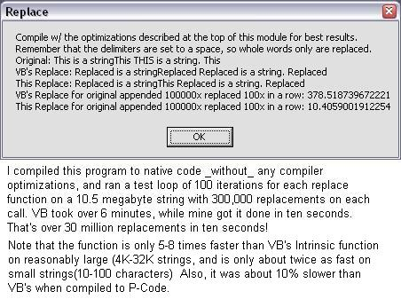



## Just another Replacement for Replace\(\) v\. 1\.1

### Description

_Now_ it's as fast as it gets, folks. Yes, Faster than the code from xbeat.net. It beats the stuffing out of VB's intrinsic replace function even without the compiler optimizations. 5x-8x faster, even though it adds the ability to use delimiters and count the number of replacements. Uses a slightly modified string mapping technique from Chris_Lucas's post here a few years ago. Thanks to Rde for the SysAllocStringByteLen declare. That, plus some changes I made to calculate all the replacements before the return string is created are what account for the additional speed in the updated version of this post.
 
### More Info
 

             |
---                |---
**Submitted On**   |2004-03-05 12:53:44
**By**             |[selftaught](https://github.com/Planet-Source-Code/PSCIndex/blob/master/ByAuthor/selftaught.md)
**Level**          |Intermediate
**User Rating**    |3.7 (26 globes from 7 users)
**Compatibility**  |VB 5\.0, VB 6\.0
**Category**       |[Miscellaneous](https://github.com/Planet-Source-Code/PSCIndex/blob/master/ByCategory/miscellaneous__1-1.md)
**World**          |[Visual Basic](https://github.com/Planet-Source-Code/PSCIndex/blob/master/ByWorld/visual-basic.md)
**Archive File**   |[Just\_anoth171646352004\.zip](https://github.com/Planet-Source-Code/selftaught-just-another-replacement-for-replace-v-1-1__1-52105/archive/master.zip)

